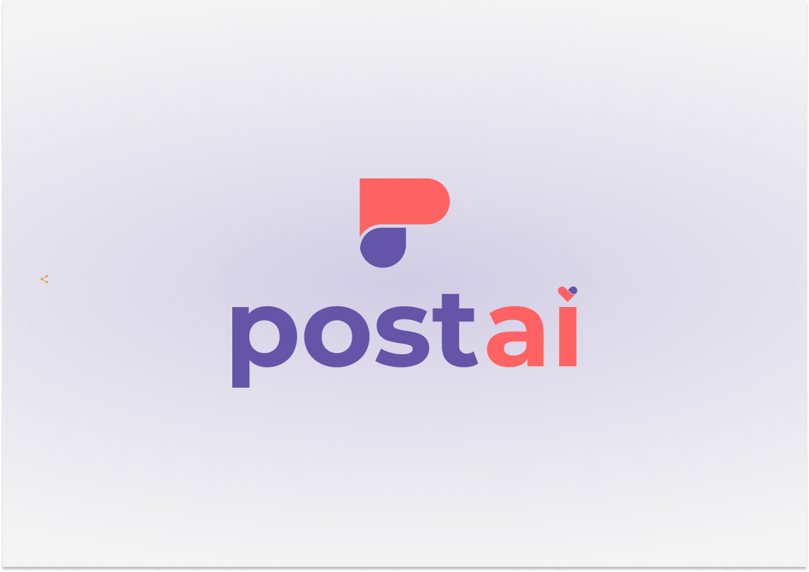

# Post.ai

Post.ai is a web application that allows you to generate social media content.

It also can help you by giving some post ideas.

## Tech stack

Post.Ai is created using

- [Sveltekit](https://kit.svelte.dev/)
- [Playwright](https://playwright.dev/) for testing
- [Vercel](https://vercel.com/) for deployment
- [Cohere API](https://cohere.ai/) for AI.

----------

This project was created for [Midudev's Hackathon](https://github.com/midudev/midu-cohere-hackathon) and has no commertial intentions.

Any code suggestion is appreciated.

Thanks!
